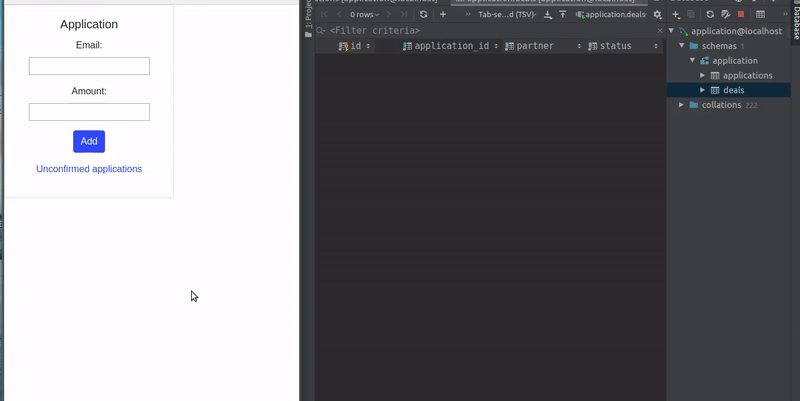

### How to run a project
1. Clone repository
2. Run ```composer install``` and ```composer dump-autoload```
3. Create a new database 'application' with 2 tables: 'applications' (id(int), email(varchar), amount(int)), 'deals' (id(int), application_id(int), partner(varchar), status(varchar))
4. Go to ```App/Core/Config/data.php``` and edit ```'username' => '...' ``` and ```'password' => '...' ``` fields
5. Run ```php -S localhost:8000```

### Description
The project has 4 routes, 2 controllers and 2 views:
* ```'/'``` (GET) Displays a form with 2 inputs ("email", "amount"), using ```ApplicationController``` ```apply()``` 
method which returns ```application.php``` view
* ```'/'``` (POST) Stores entered data into database ```applications``` table using ApplicationController ```store()``` 
method. Depending on the ```amount``` the value of column ```partner``` in ```deals``` table  may differ: if 
```amount```>5000, the ```partner``` is "A", else - "B". As well there is a prototype of sending email to the
corresponding partner.
* ```'/deals'``` (GET) Displays a list of deals with value "ask" in ```status``` column of ```deals``` table, 
using DealsController ```deals()``` method which returns ```deals.php``` view. 
* ```'/deals'``` (POST) Gives an opportunity to ```Send an offer``` to those clients who are displayed in a list. When 
the button is clicked, the value "ask" in ```status``` column is replaced with "offer" and email to that client is sent.
